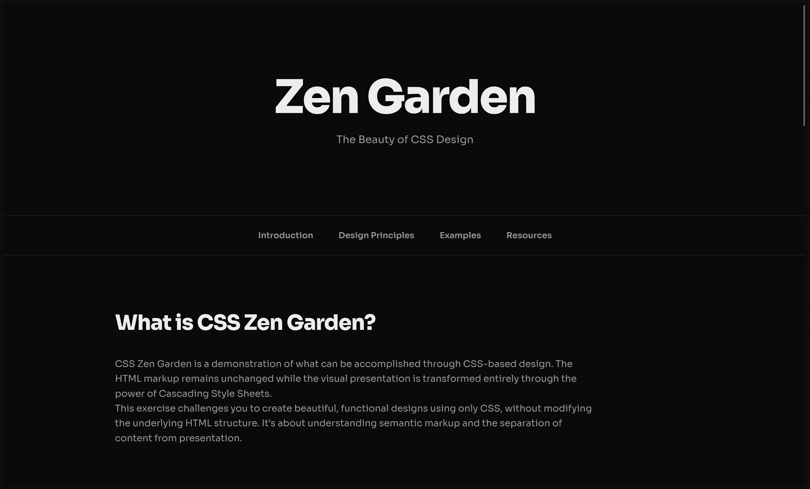

# Mini Project of Zen Garden Using modified CSS Only

Proyek ini adalah sebuah tugas Pemrograman Web dimana kita belajar cara pembuatan sebuah website dari native HTML + CSS. Kita diajarkan benar benar dari awal penerapan CSSnya sehingga kita bisa paham secara mendetail cara penggunaan dari CSSnya.

## 📄 Lisensi
Proyek ini dilisensikan di bawah Lisensi MIT. Lihat file `LICENSE` untuk detail lebih lanjut.